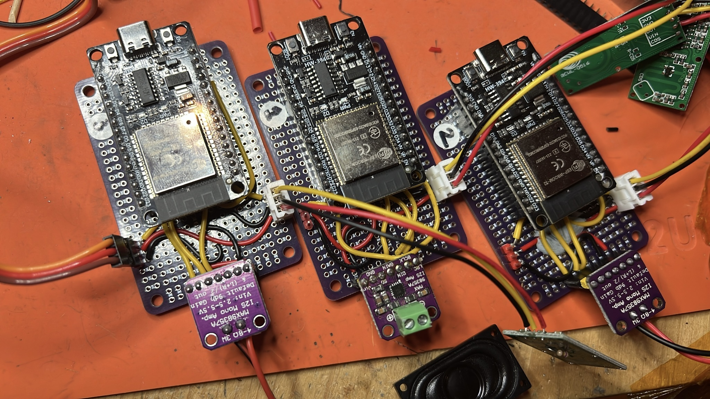
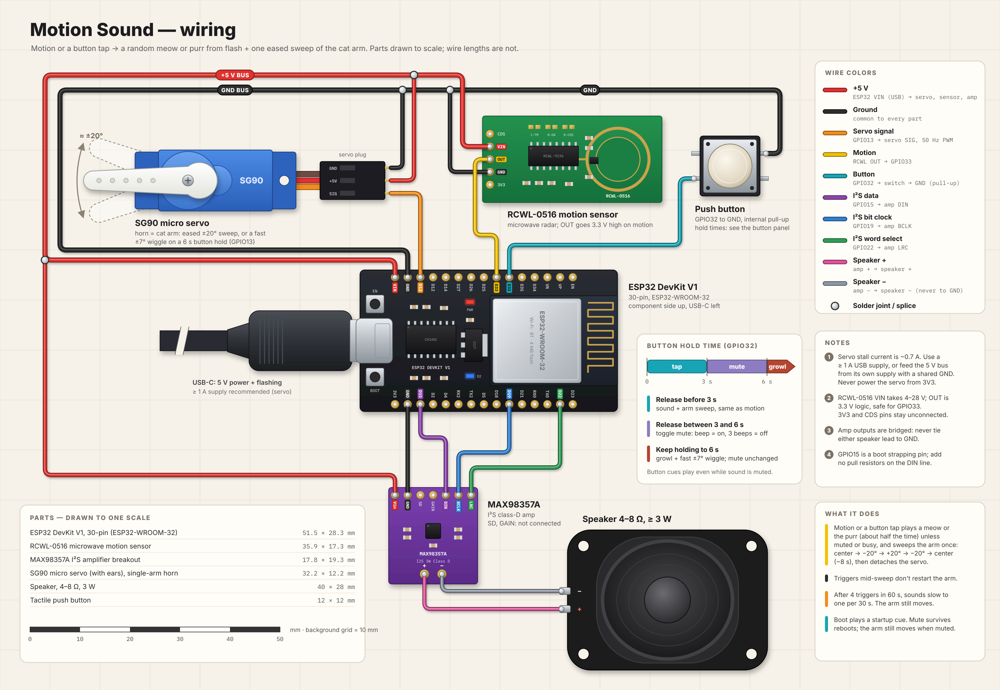

# Motion Sound

An example project for building a standalone ESPHome sound-effects (SFX) device, used to make an interactive object that plays a sound and moves something when motion is detected. An ESP32-WROOM DevKit V1 reads a binary presence/motion sensor and randomly plays a short meow stored in firmware flash as MP3 through a MAX98357 I²S amplifier. A servo on the cat arm does one eased sweep and then holds center when motion is detected. Detection, random selection, and playback run locally on the device; Wi-Fi and Home Assistant are not required.



## Hardware and wiring



The diagram draws every part at the same scale (wire lengths are not to scale). It takes 5 V for the servo, sensor, and amplifier from the ESP32 VIN pin, which carries USB 5 V.

| Signal | ESP32 GPIO | Connect to |
| --- | ---: | --- |
| Motion sensor output | GPIO33 | Binary sensor output |
| Button | GPIO32 | Momentary switch to GND (internal pull-up) |
| Servo signal | GPIO13 | Servo PWM, 50 Hz |
| I²S data out (DIN) | GPIO15 | MAX98357 DIN |
| I²S word select (LRCLK/WS) | GPIO22 | MAX98357 LRCLK |
| I²S bit clock (BCLK) | GPIO19 | MAX98357 BCLK |
| Amplifier power and ground | — | 2.5–5.5 V at VIN; share GND with ESP32 |
| Speaker output | — | Connect a 4 Ω+ speaker across the amplifier outputs; do not ground either output |

On each motion rising edge, and on a short button press, the servo eases from center to the front, sweeps once to the back, eases back to center, and keeps holding center. The servo stays attached between activations: a detached arm drifts, and the next sweep would snap it back to center at full speed. At boot the arm is centered immediately. The arm has a mutex: while a sweep or growl wiggle is running, new triggers do not start another movement, but every trigger still plays a new meow (unless muted or rate limited). Releasing the button after 3 seconds and before 6 seconds toggles sound mute: `beep.wav` plays when mute turns on, and `3beeps.wav` plays when it turns off. Holding past 6 seconds plays `growl.wav` and wiggles the arm for about 2 seconds over a shorter arc at about 3× the sweep step rate, and does not change mute. Boot plays the clip named by `boot_sound`: `win-startup.wav` as configured, or `beep.wav` when it is set to `beep`; after that cue finishes, the normal meow and arm sequence runs once. Mute is kept across reboot, so the startup arm movement still runs when muted but its meow is suppressed; cue sounds play even while meows are muted. Power the servo from a supply that can handle its stall current, and share ground with the ESP32. Do not power the servo from the ESP32 3.3 V pin.

Home Assistant gets these buttons: **Animate Arm** (arm sweep only), **Meow** (random meow only), and **Meow and Arm** (both). A **Hola** button plays only the hola clip, for debugging. These manual actions ignore mute and the meow rate limit; the arm sweep is still skipped if the arm is already moving.

If the saved Wi-Fi network can't be reached for 1 minute, the device starts a fallback hotspot named after the device (for example `gato-dorado-2e90`), protected by `fallback_ap_password` in `secrets.yaml`. That file is gitignored: copy [`secrets.example.yaml`](secrets.example.yaml) to `secrets.yaml` and set your own password (at least 8 characters) before building; the Makefile stops with a message if it is missing. Join it from a phone or laptop: the captive portal opens (or browse to `http://192.168.4.1`) to scan for and save a Wi-Fi network. OTA and the Home Assistant API also work over the hotspot. The device keeps retrying the saved network while the hotspot is up.

The **Mute** switch shows and sets the same sound mute as the 3–6 second button hold, with the same beep cues; it follows button changes too.

The **Arm Speed** slider (0–10, default 7, kept across reboot) scales the sweep and wiggle speed: 5 is the base speed (2 s per sweep segment, set by `sweep_segment_ms`), 7 is about 0.87 s, 0 is slowest (about 3.5 s), and 10 is fastest (0.25 s). Each step changes speed by a constant ratio within each half of the range.

Confirm the presence sensor's output polarity and electrical level before connecting it; ESP32 GPIOs are not 5 V tolerant. GPIO15 is a boot-strapping pin; the MAX98357 DIN input should be high impedance, but avoid adding pulls to GPIO15 and move I²S DOUT to another suitable GPIO if the board has boot issues.

For amplifier pinout details, see [Adafruit's MAX98357 pinout guide](https://learn.adafruit.com/adafruit-max98357-i2s-class-d-mono-amp/pinouts). The MAX98357 takes digital I²S (not analog audio), and MCLK is not required. Its speaker outputs are bridge-tied/floating: use a 4 Ω or higher moving-coil speaker across the output pair, and do not connect either speaker terminal to ground. The amp supply range is 2.5–5.5 V; Adafruit recommends 5 V for higher output power with a supply sized for the speaker load. ESP32 3.3 V logic is compatible with the I²S inputs. Follow the markings/specifications for the specific amplifier breakout in use.

## Build, flash, and logs

Requirements: Python 3.12 or newer, GNU Make (or compatible `make`), and internet access for the initial setup and sound downloads. The Makefile creates local virtual environments and installs the pinned ESPHome versions automatically.

```sh
make config
make compile
make flash PORT=/dev/cu.YOUR_ESP32_SERIAL_PORT # macOS; Linux commonly uses /dev/ttyUSB0
make ota                                    # uses gato-dorado-2e90.local
make ota OTA_HOST=10.0.1.23                # bypasses mDNS
make logs PORT=/dev/cu.YOUR_ESP32_SERIAL_PORT
```

The motion input is GPIO33. The I²S connections are listed above. If the first upload cannot enter bootloader mode automatically, hold the board's BOOT button while starting the flash, then release it when writing begins.

The OTA target installs its tools on first use, compiles, and uploads the generated OTA binary on port `3232`. The separate `.venv-ota` environment uses the system Python on macOS to avoid local-network permission failures from Homebrew Python. Set `OTA_PASSWORD` if the device has an OTA password.

The sound URL manifest is [`sounds/sources.txt`](sounds/sources.txt). Cue clips live in [`media/sfx/`](media/sfx/). `make config`, `make compile`, `make flash`, `make ota`, and `make logs` prepare sounds before invoking ESPHome. Original downloads are cached under `.cache/sounds/downloads/`; normalized files consumed by ESPHome are under `.cache/sounds/`. Both are gitignored, so generated WAV and MP3 files are not tracked in this repository. The `media/sfx/` sources are tracked.

```sh
make clean
```

`make clean` removes the sound cache and ESPHome build output. The next build command re-downloads the URLs, normalizes the WAVs, and encodes the MP3s again.

## Sound effects

The manifest maps these ESPHome `audio_file` IDs to source WAVs from [haydenroche5/meow_dataset](https://github.com/haydenroche5/meow_dataset):

| ESPHome ID | Source WAV |
| --- | --- |
| `meow_youtube_04` | [youtube_yKb90ItHtn0_4.wav](https://raw.githubusercontent.com/haydenroche5/meow_dataset/master/meow/youtube_yKb90ItHtn0_4.wav) |
| `meow_youtube_27` | [youtube_yKb90ItHtn0_27.wav](https://raw.githubusercontent.com/haydenroche5/meow_dataset/master/meow/youtube_yKb90ItHtn0_27.wav) |
| `meow_kaggle_36_0` | [kaggle_cat_36_0.wav](https://raw.githubusercontent.com/haydenroche5/meow_dataset/master/meow/kaggle_cat_36_0.wav) |
| `meow_kaggle_31_13` | [kaggle_cat_31_13.wav](https://raw.githubusercontent.com/haydenroche5/meow_dataset/master/meow/kaggle_cat_31_13.wav) |
| `meow_kaggle_14_2` | [kaggle_cat_14_2.wav](https://raw.githubusercontent.com/haydenroche5/meow_dataset/master/meow/kaggle_cat_14_2.wav) |
| `meow_kaggle_18_0` | [kaggle_cat_18_0.wav](https://raw.githubusercontent.com/haydenroche5/meow_dataset/master/meow/kaggle_cat_18_0.wav) |
| `meow_kaggle_20_0` | [kaggle_cat_20_0.wav](https://raw.githubusercontent.com/haydenroche5/meow_dataset/master/meow/kaggle_cat_20_0.wav) |
| `meow_kaggle_23_2` | [kaggle_cat_23_2.wav](https://raw.githubusercontent.com/haydenroche5/meow_dataset/master/meow/kaggle_cat_23_2.wav) |
| `meow_kaggle_23_4` | [kaggle_cat_23_4.wav](https://raw.githubusercontent.com/haydenroche5/meow_dataset/master/meow/kaggle_cat_23_4.wav) |
| `meow_kaggle_29_6` | [kaggle_cat_29_6.wav](https://raw.githubusercontent.com/haydenroche5/meow_dataset/master/meow/kaggle_cat_29_6.wav) |
| `meow_kaggle_34_2` | [kaggle_cat_34_2.wav](https://raw.githubusercontent.com/haydenroche5/meow_dataset/master/meow/kaggle_cat_34_2.wav) |
| `meow_kaggle_39_0` | [kaggle_cat_39_0.wav](https://raw.githubusercontent.com/haydenroche5/meow_dataset/master/meow/kaggle_cat_39_0.wav) |
| `meow_kaggle_42_0` | [kaggle_cat_42_0.wav](https://raw.githubusercontent.com/haydenroche5/meow_dataset/master/meow/kaggle_cat_42_0.wav) |
| `meow_kaggle_42_1` | [kaggle_cat_42_1.wav](https://raw.githubusercontent.com/haydenroche5/meow_dataset/master/meow/kaggle_cat_42_1.wav) |
| `meow_kaggle_46_4` | [kaggle_cat_46_4.wav](https://raw.githubusercontent.com/haydenroche5/meow_dataset/master/meow/kaggle_cat_46_4.wav) |
| `meow_kaggle_47_1` | [kaggle_cat_47_1.wav](https://raw.githubusercontent.com/haydenroche5/meow_dataset/master/meow/kaggle_cat_47_1.wav) |
| `meow_kaggle_48_0` | [kaggle_cat_48_0.wav](https://raw.githubusercontent.com/haydenroche5/meow_dataset/master/meow/kaggle_cat_48_0.wav) |
| `meow_kaggle_52_0` | [kaggle_cat_52_0.wav](https://raw.githubusercontent.com/haydenroche5/meow_dataset/master/meow/kaggle_cat_52_0.wav) |
| `meow_kaggle_57_2` | [kaggle_cat_57_2.wav](https://raw.githubusercontent.com/haydenroche5/meow_dataset/master/meow/kaggle_cat_57_2.wav) |
| `meow_kaggle_58_1` | [kaggle_cat_58_1.wav](https://raw.githubusercontent.com/haydenroche5/meow_dataset/master/meow/kaggle_cat_58_1.wav) |
| `meow_youtube_dc_22` | [youtube_acm9dCI5_dc_22.wav](https://raw.githubusercontent.com/haydenroche5/meow_dataset/master/meow/youtube_acm9dCI5_dc_22.wav) |
| `meow_youtube_dc_24` | [youtube_acm9dCI5_dc_24.wav](https://raw.githubusercontent.com/haydenroche5/meow_dataset/master/meow/youtube_acm9dCI5_dc_24.wav) |
| `meow_youtube_dc_34` | [youtube_acm9dCI5_dc_34.wav](https://raw.githubusercontent.com/haydenroche5/meow_dataset/master/meow/youtube_acm9dCI5_dc_34.wav) |
| `meow_youtube_dc_42` | [youtube_acm9dCI5_dc_42.wav](https://raw.githubusercontent.com/haydenroche5/meow_dataset/master/meow/youtube_acm9dCI5_dc_42.wav) |
| `meow_youtube_dc_52` | [youtube_acm9dCI5_dc_52.wav](https://raw.githubusercontent.com/haydenroche5/meow_dataset/master/meow/youtube_acm9dCI5_dc_52.wav) |

The meow source clips are already mono, 16-bit, 16 kHz, so downsampling is unnecessary. `scripts/prepare_sounds.py` fetches each URL, strips trailing metadata chunks, normalizes the peak to -1 dBFS, and pads an odd sample count by one silent frame. The padding avoids a decoder edge case observed with one odd-length clip. The same script converts `media/sfx/` to mono 16 kHz: `beep.wav` and `win-startup.wav` are mixed down from stereo, `growl.wav` is decoded from AIFF, and `purring.wav` and `win-startup.wav` are resampled from 22 kHz. Each normalized WAV is then encoded to a 32 kbps mono MP3 with `lameenc` (installed into `.venv` from `requirements.txt`), and the MP3s are embedded in firmware flash. MP3 is about 8× smaller than 16-bit WAV, which keeps the image well below the OTA app partition size; the ESP32 decodes MP3 in firmware. To add a meow, append a line to `sounds/sources.txt`, add a matching `audio_file` entry, and add its URL to the `MEOWS` list in `play_random_meow`.

| ESPHome ID | Source | When it plays |
| --- | --- | --- |
| `beep` | `media/sfx/beep.wav` | Mute turns on, and boot when `boot_sound` is `beep` |
| `three_beeps` | `media/sfx/3beeps.wav` | Mute turns off |
| `win_startup` | `media/sfx/win-startup.wav` | Boot, when `boot_sound` is `win_startup` (the configured default) |
| `growl` | `media/sfx/growl.wav` | Button held for 6 seconds, with the arm wiggle |
| `hola` | `media/sfx/hola.wav` | Spanish "hola", picked at random like a meow (it is in the `MEOWS` list) |
| `purring` | `media/sfx/purring.wav` | Random motion or short-press clip, weighted by `purr_ratio` |

Each motion rising edge, and each short press of the GPIO32 button, picks a clip if the player is idle and sound is not muted. The log line prints the clip ID. Meows are picked uniformly from the `MEOWS` list in `play_random_meow`. `purr_ratio` at the top of `motion-sound.yaml` is how many times more often the purr is chosen than any one meow; the configured `0` plays only meows. Every additional embedded clip increases firmware/flash usage. Releasing the button between 3 and 6 seconds toggles mute and stops any clip that is playing. A hold of 6 seconds plays the growl and wiggles the arm without changing mute.

Meow playback is rate limited by the substitutions at the top of `motion-sound.yaml`. The defaults allow 4 triggers in 60 seconds, then at most one meow every 30 seconds. Triggers past that limit still move the arm. A quiet gap of one full window restores a meow on every trigger. Button cues are not limited.

The presence sensor used during bring-up is documented at [RCWL-0516](https://github.com/tarantula3/RCWL-0516).
